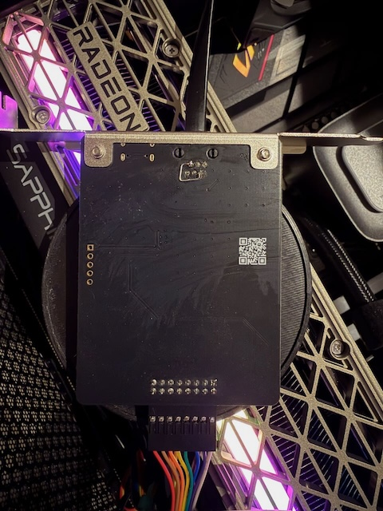

### ATX Power Control Firmware

[Discord](https://jetkvm.com/discord) | [Website](https://jetkvm.com) | [Issues](https://github.com/jetkvm/cloud-api/issues) | [Docs](https://jetkvm.com/docs)

This is an ATX power control module for the JetKVM platform, built on the Raspberry Pi RP2040, the same chip as the Raspberry Pi Pico. It provides remote control of PC power and reset functions, along with status monitoring of power and drive activity LEDs.

## Features
- Remote control of PC power and reset buttons via UART interface
- Power and HDD activity LED status monitoring

# Unofficial Fix for ATX Expansion Boards Shipped with Incorrectly Configured UART Pins

This fix requires a hardware modification to work correctly. Pins 2 and 5 must be bridged. See `HW-Mod-Example.jpg`.

Without this modification, the board will handle power and reset commands but will not report LED status, which may be required for accurate device state monitoring.

**PIO UART**: The firmware uses PIO-based UART (rather than hardware UART) to allow TX and RX to be assigned to non-default pins.

# Installation

A pre-built UF2 binary is available in the `binaries/` directory for drag-and-drop installation:

1. Hold the BOOTSEL button on the Pico and connect it via USB — it will mount as a mass storage device.
2. Copy `binaries/jetkvm-atx.uf2` to the drive. The Pico will reboot automatically.

# Development

The firmware is written in C using the Raspberry Pi Pico SDK (version 2.0.0). To get started, see [Getting Started with the Raspberry Pi Pico-Series](https://rptl.io/pico-get-started) for information on how to install the SDK and build the project.
